# Trade 12

## Setup
- Pair: XRPUSDT
- Direction: Short
- Mode: paper
- Take Profit: 3.16877535
- Stop Loss: 3.2022315

## Notes
<!-- Add trade notes here -->

## Images
### 10s
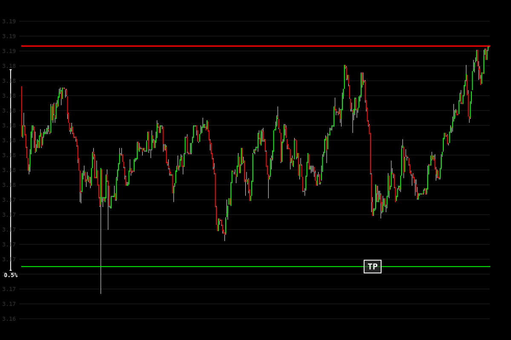

### 30s
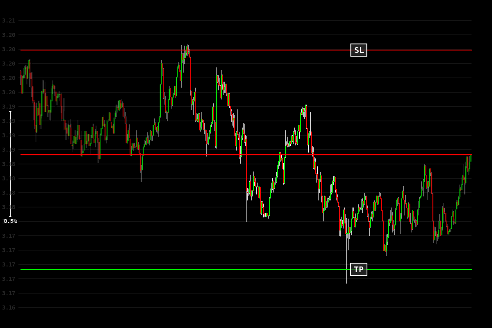

### 1m
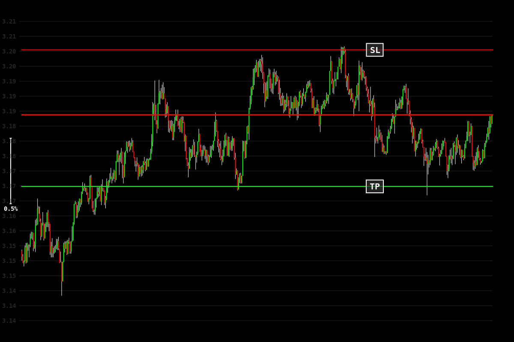

### 5m
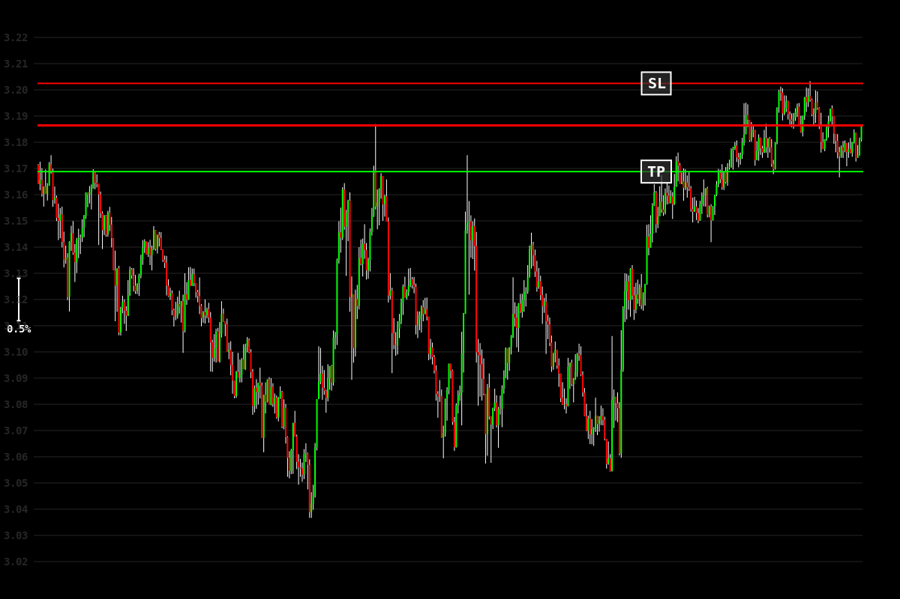

### 15m
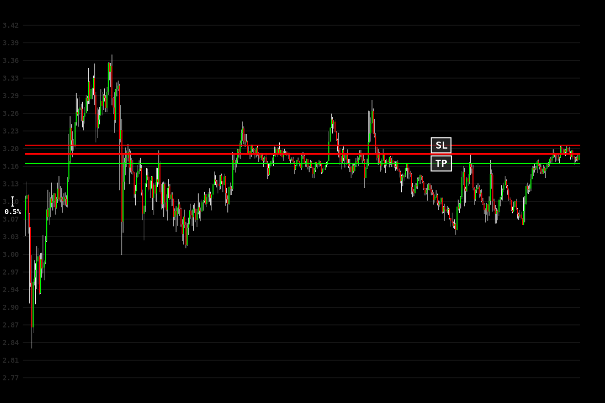

### 30m
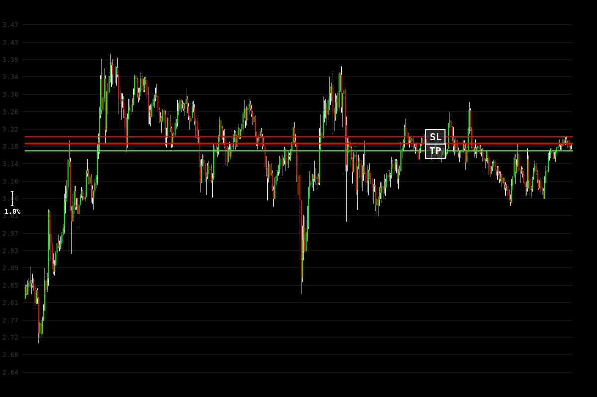

### 1h

### 4h
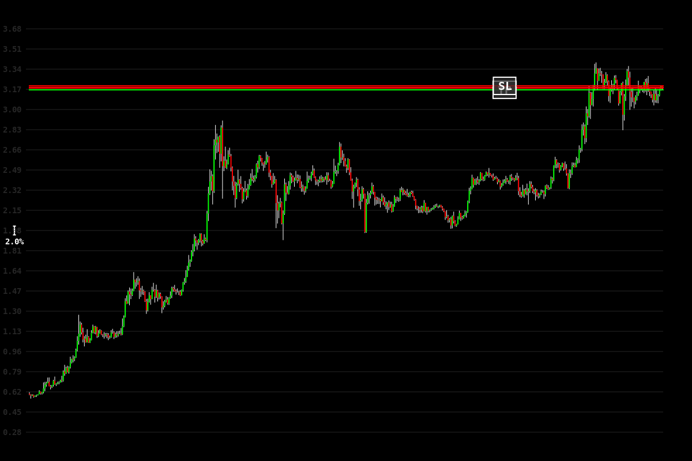

### 8h
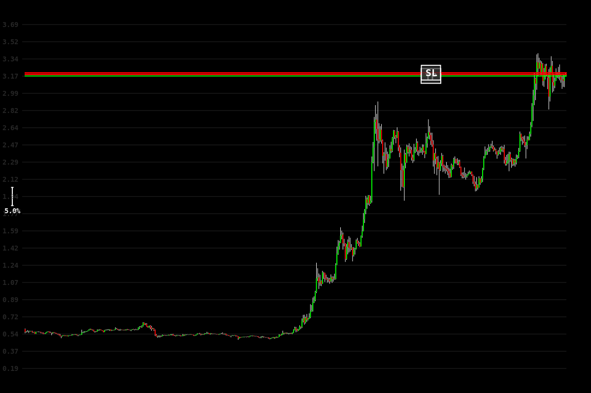

## Results

## Results
- Exit Type: tp
- PnL: $21.90
- Exit Time: 2025-01-24 15:33:13
- Trade Duration: 8 minutes

### Exit Images
#### 10s
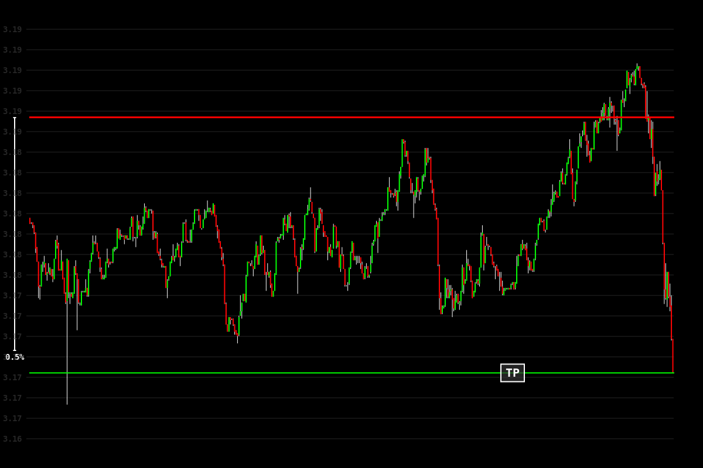

#### 30s
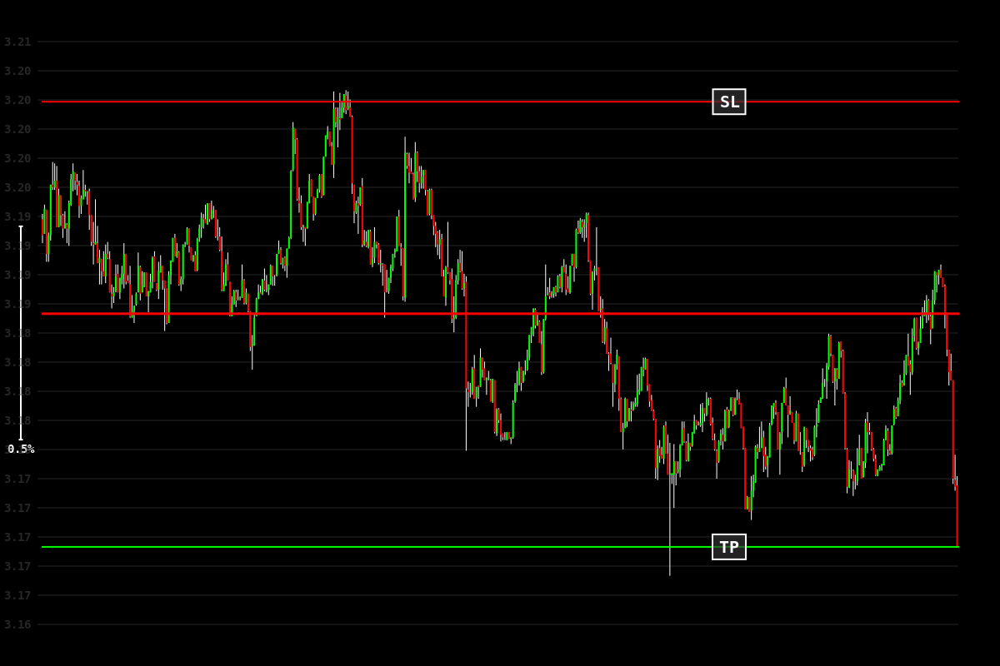

#### 1m
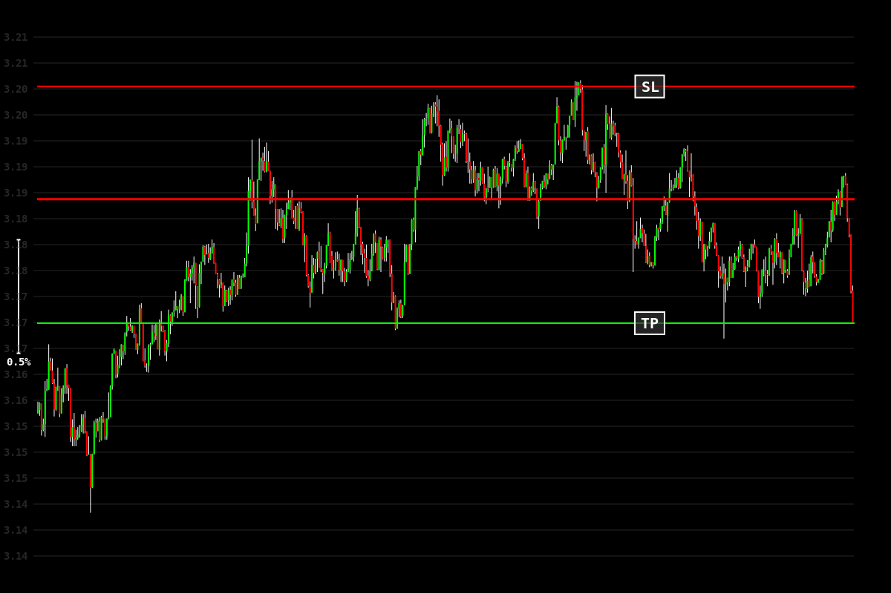

#### 5m
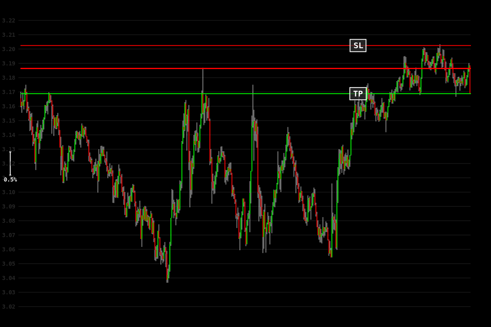

#### 15m
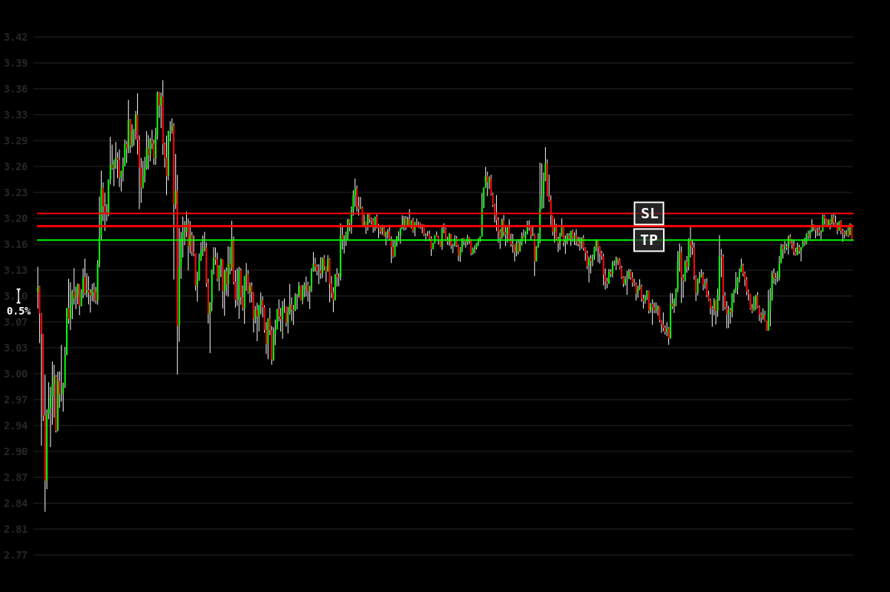

#### 30m

#### 1h
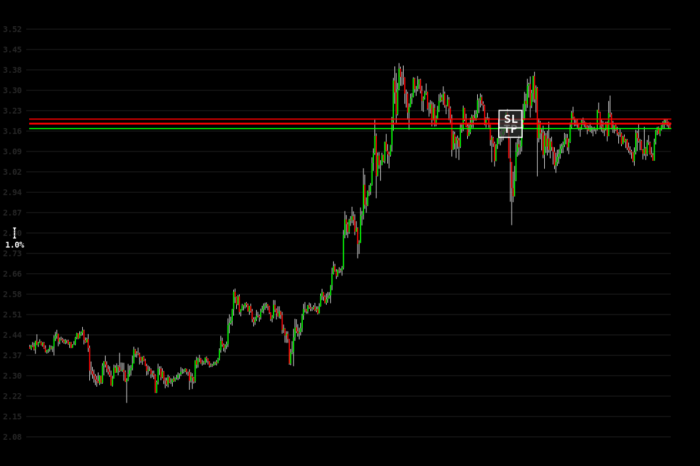

#### 4h

#### 8h

