# Trade 44

## Setup
- Pair: WIFUSDT
- Direction: Short
- Mode: real
- Take Profit: 1.301
- Stop Loss: 1.325
- Equity before: **428.6179256163**

## Notes
<!-- Add trade notes here -->

## Images
### 10s
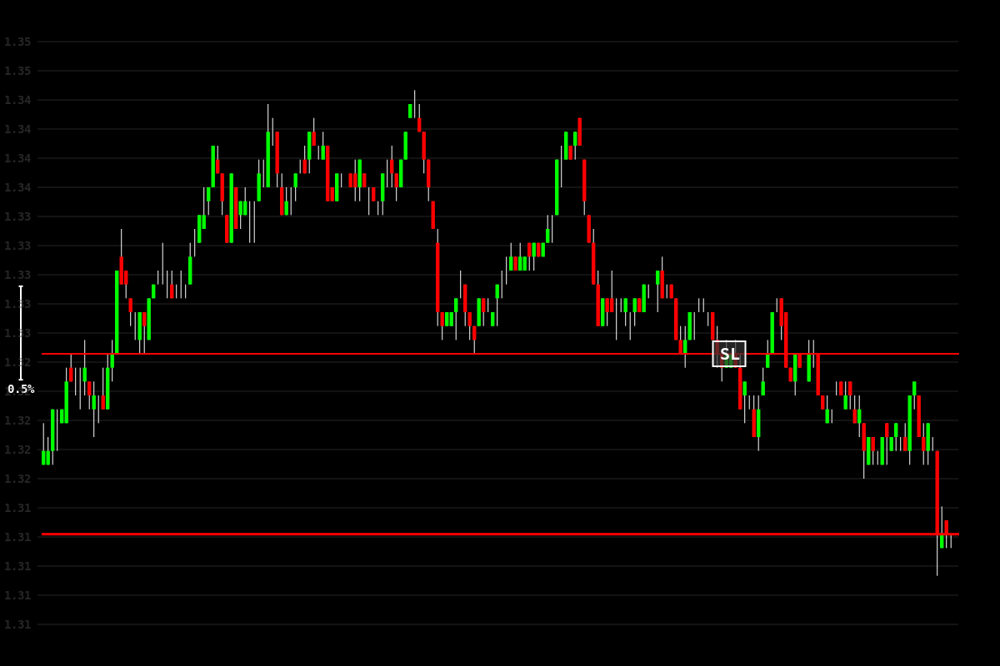

### 30s
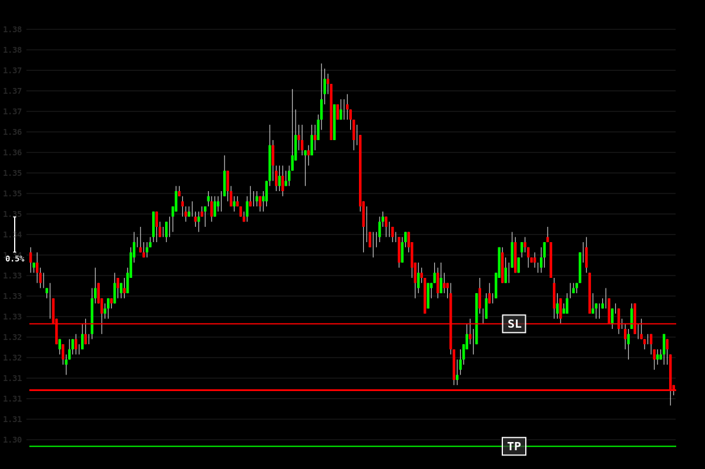

### 1m
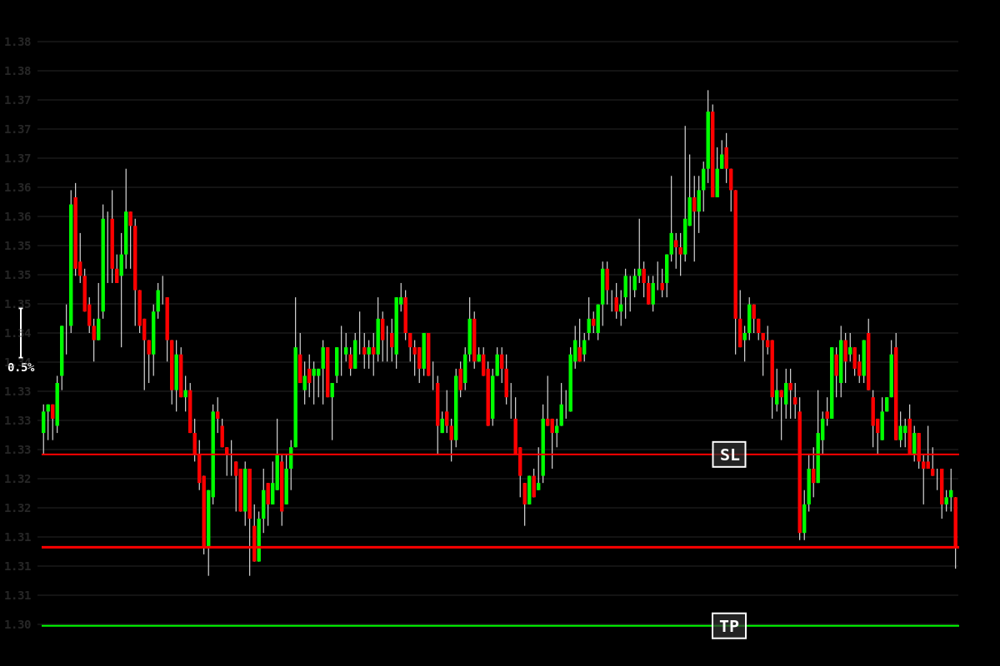

### 5m
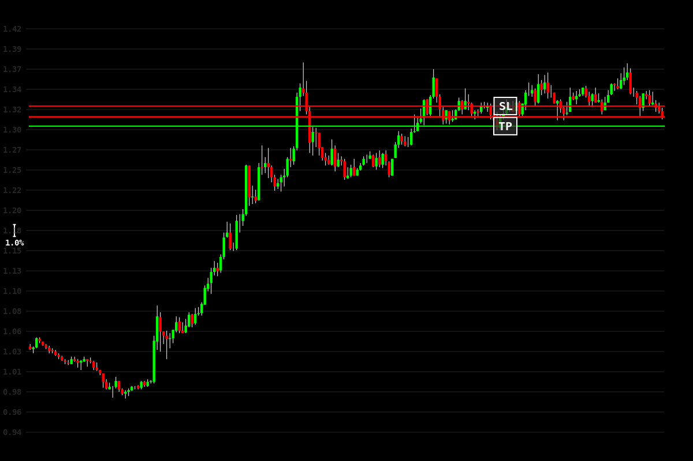

### 15m
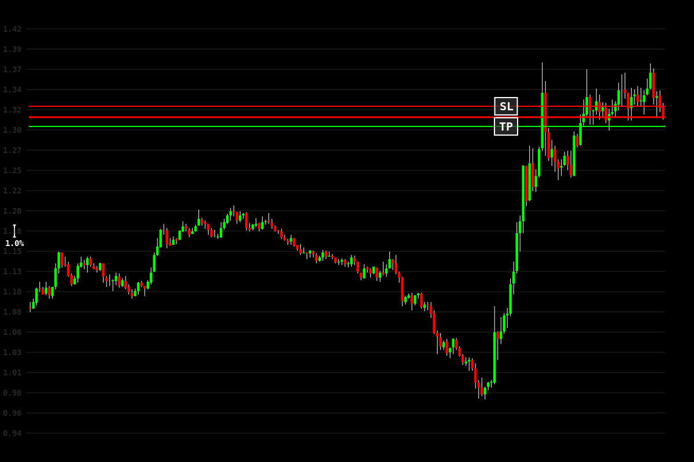

### 30m
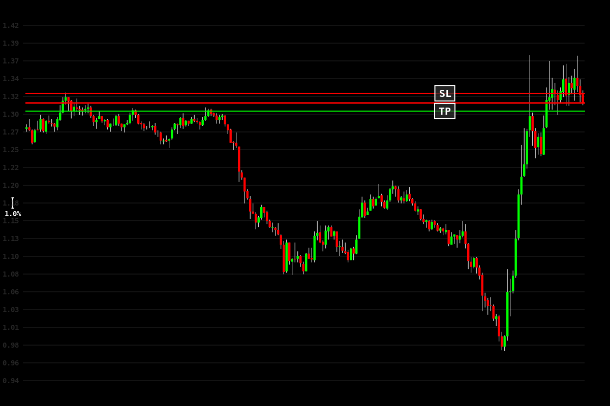

### 1h
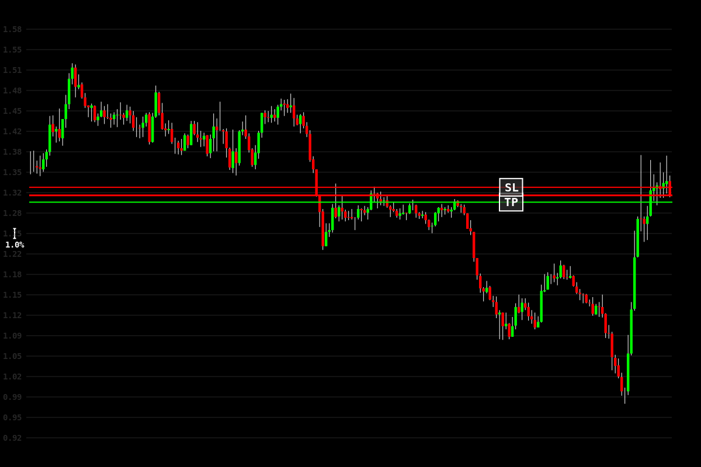

### 4h

### 8h

## Results

## Results
- Exit Type: exit
- PnL: $0.07
- Exit Time: 2025-01-29 14:06:56
- Trade Duration: 30 minutes
- Equity after: **436.40085611999996**

### Exit Images
#### 10s
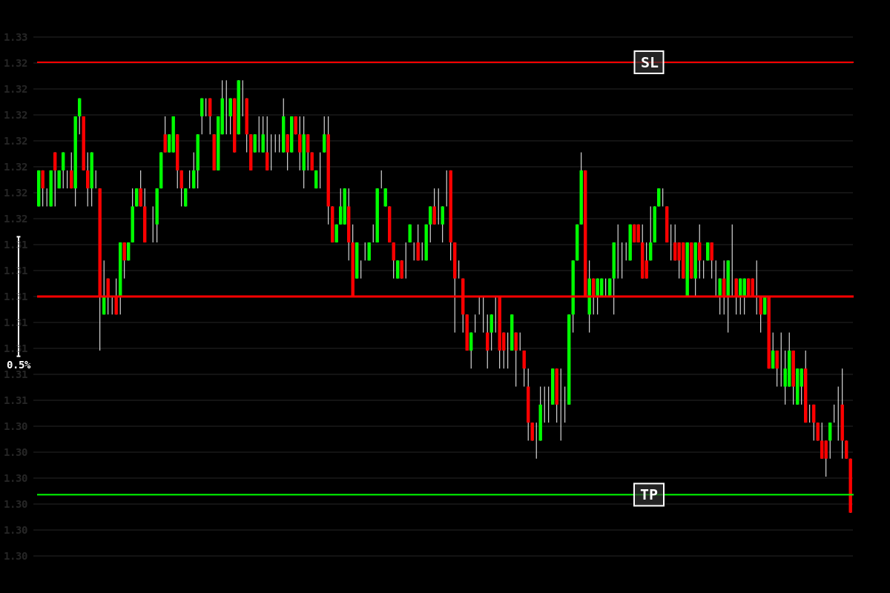

#### 30s
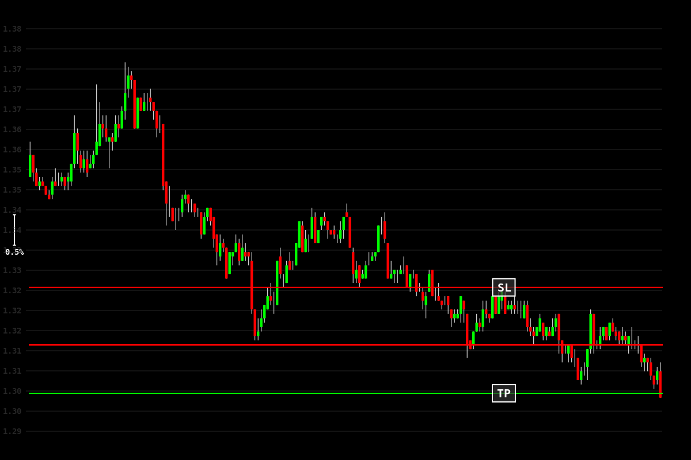

#### 1m

#### 5m
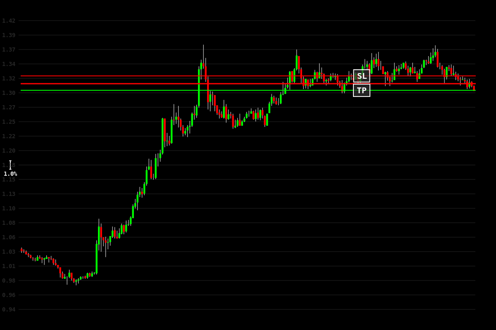

#### 15m
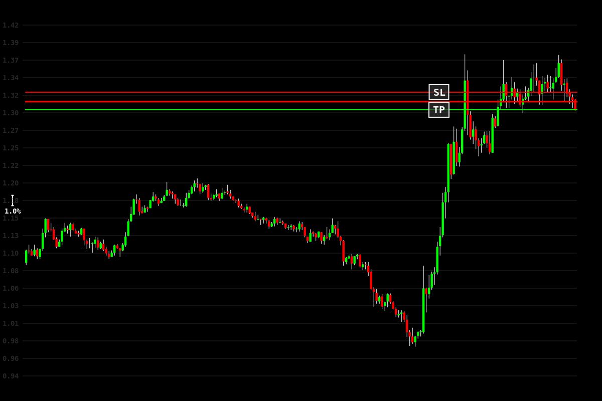

#### 30m
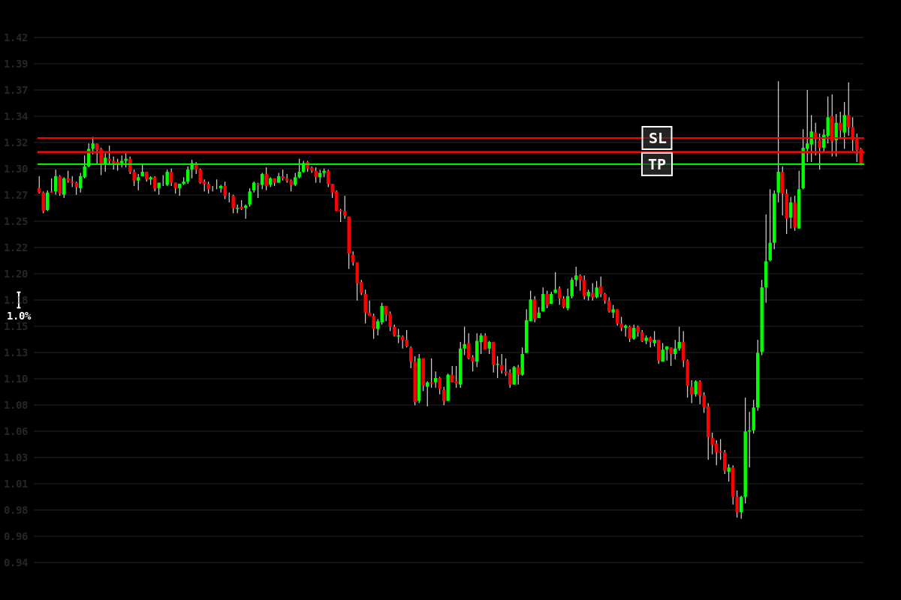

#### 1h
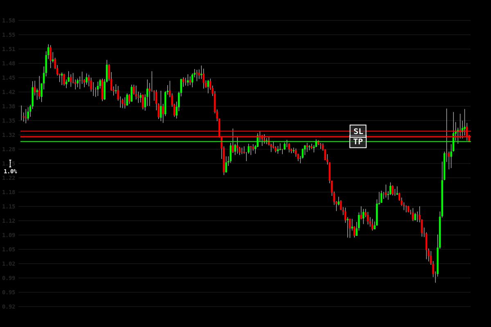

#### 4h
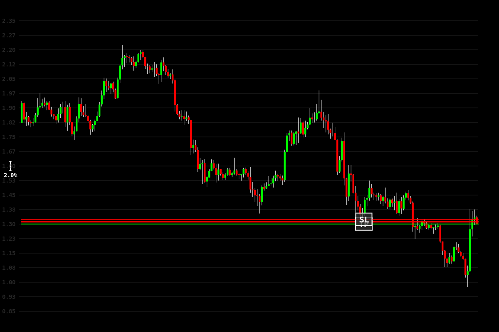

#### 8h
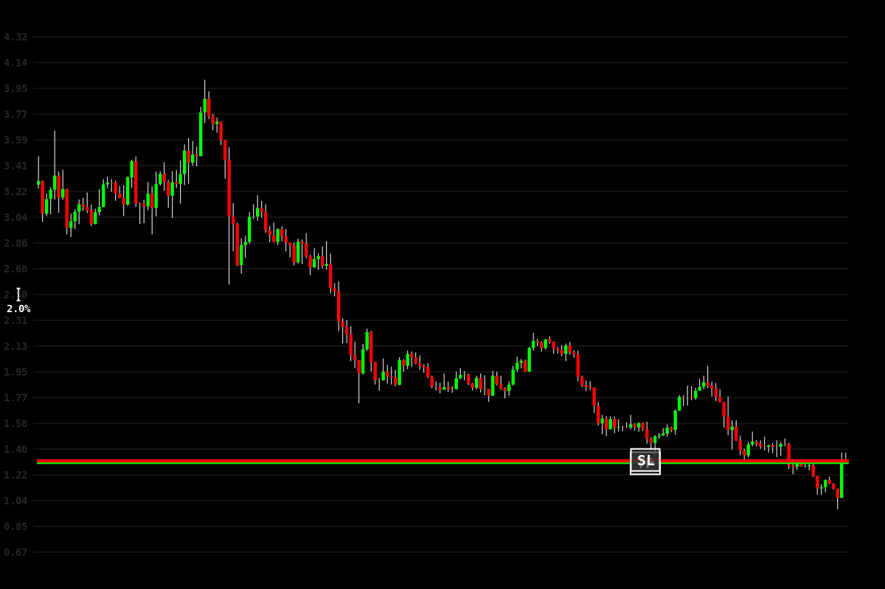

