# Trade 46

## Setup
- Pair: WIFUSDT
- Direction: Long
- Mode: real
- Take Profit: 1.228
- Stop Loss: 1.167
- Equity before: **430.03131449719996**

## Notes
<!-- Add trade notes here -->

## Images
### 10s
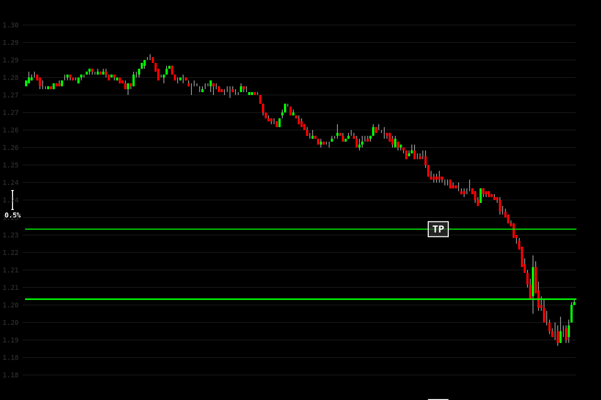

### 30s
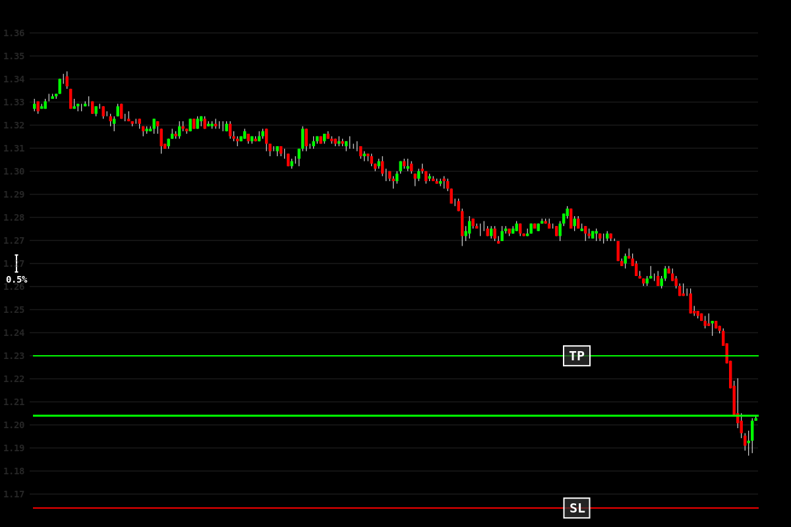

### 1m
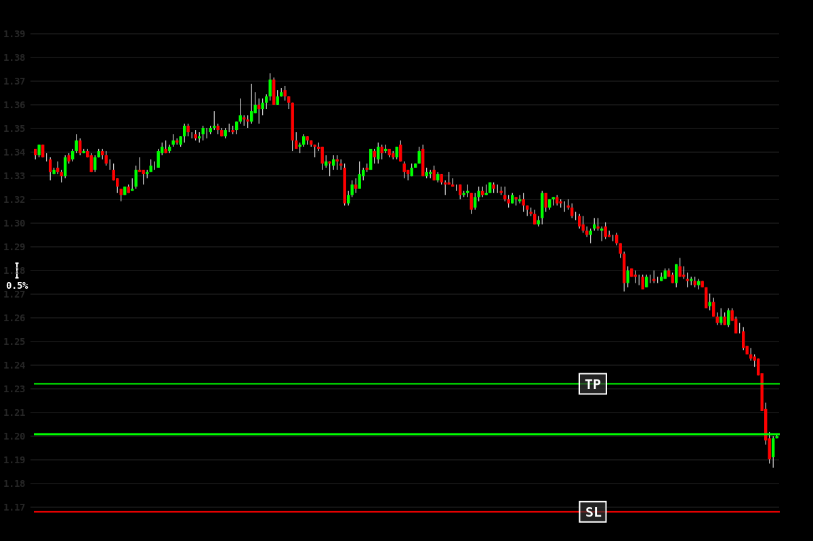

### 5m
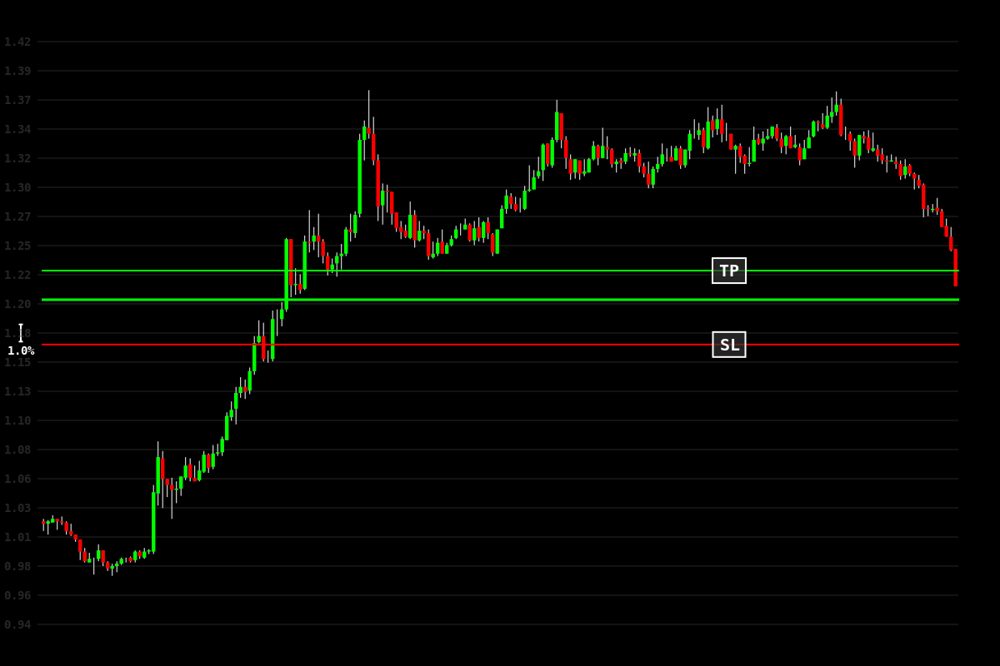

### 15m
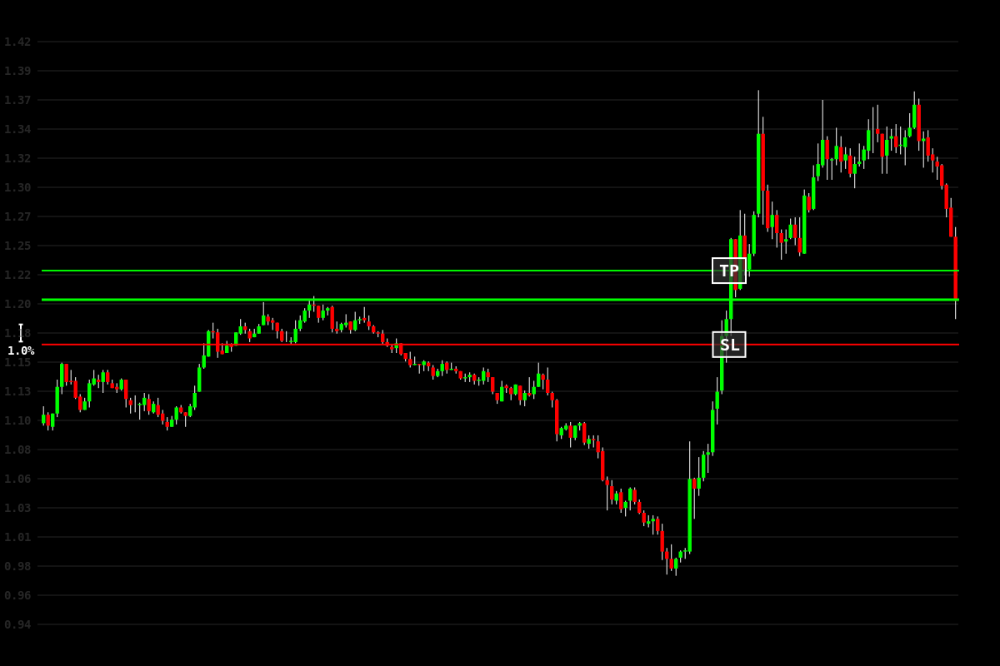

### 30m
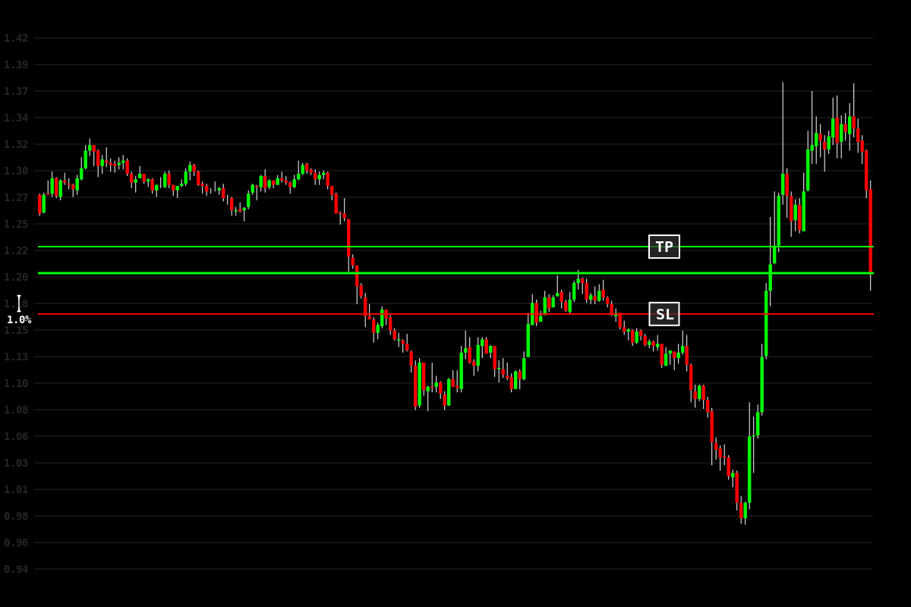

### 1h

### 4h
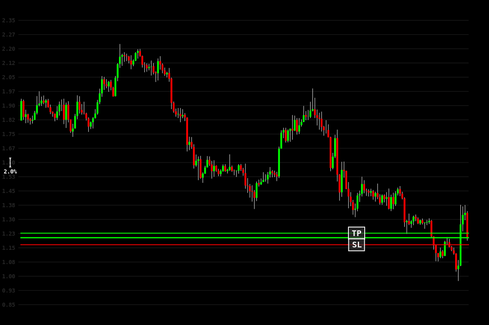

### 8h

## Results

## Results
- Exit Type: exit
- PnL: $1.43
- Exit Time: 2025-01-29 15:21:11
- Trade Duration: 23 minutes
- Equity after: **430.99589558**

### Exit Images
#### 10s
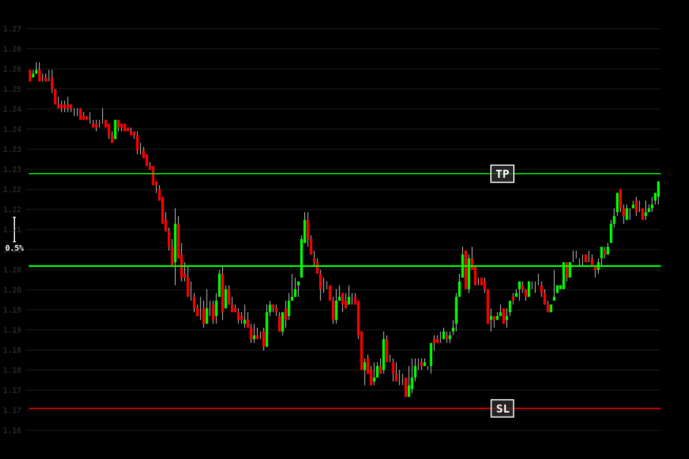

#### 30s
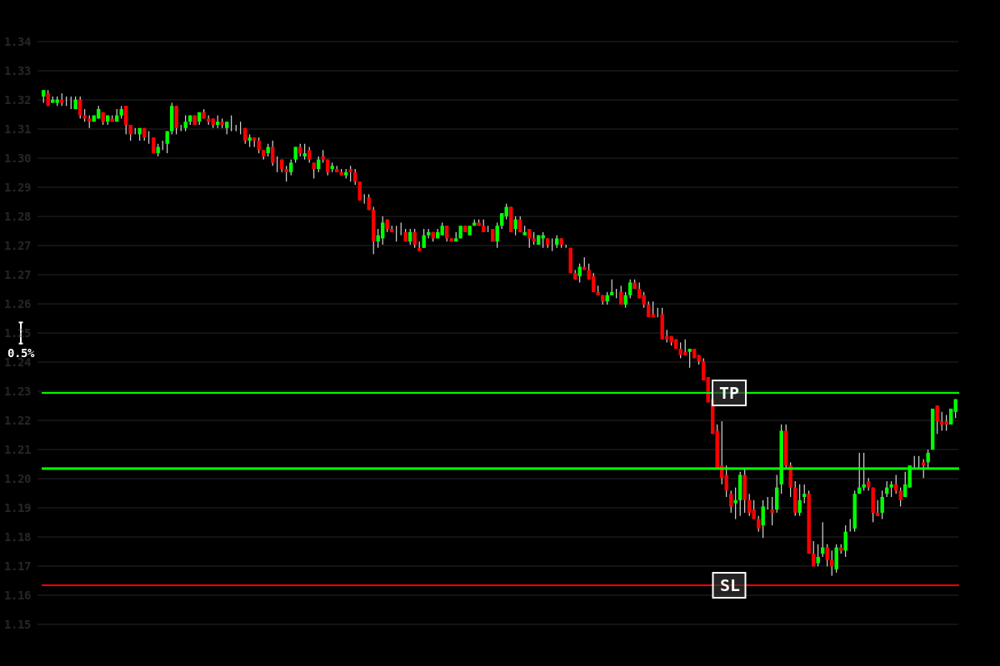

#### 1m
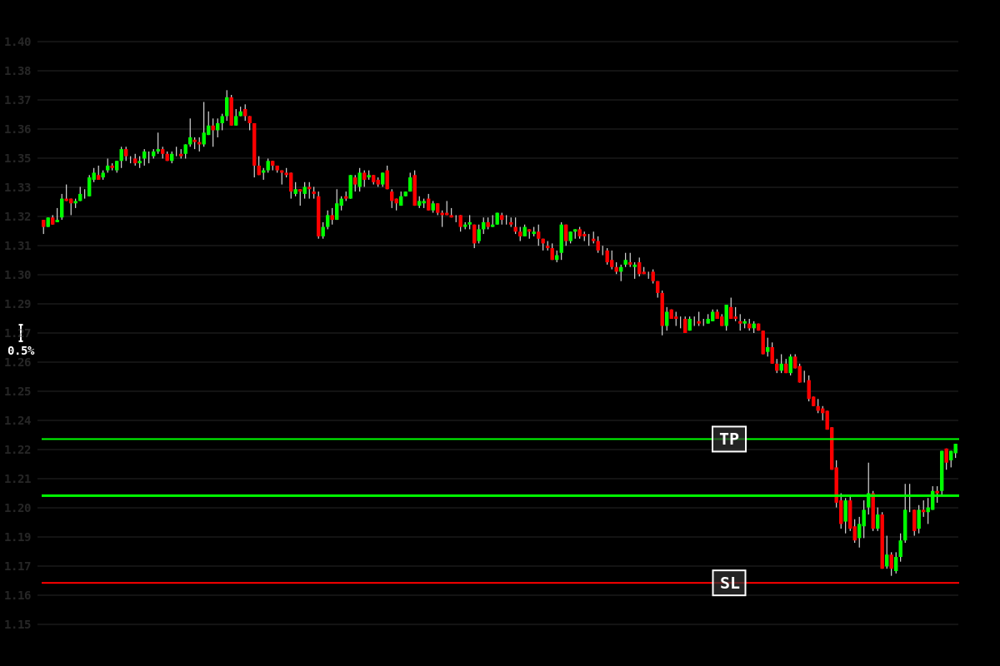

#### 5m
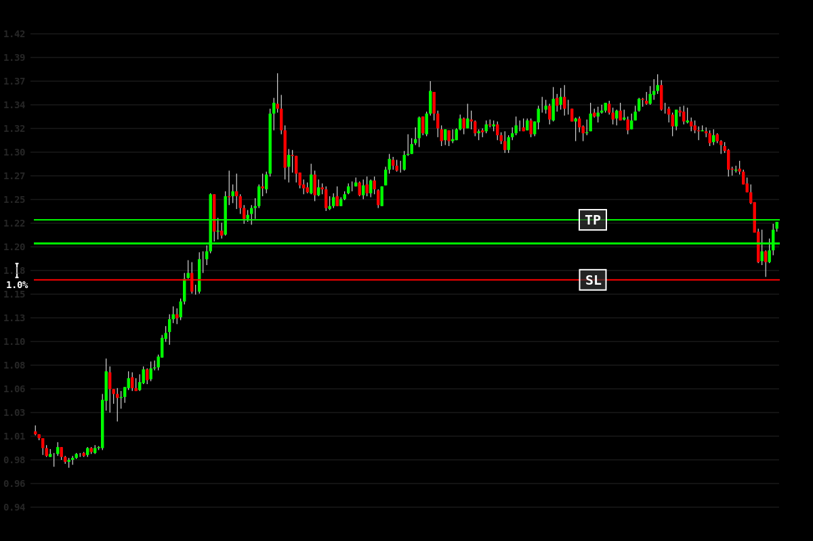

#### 15m
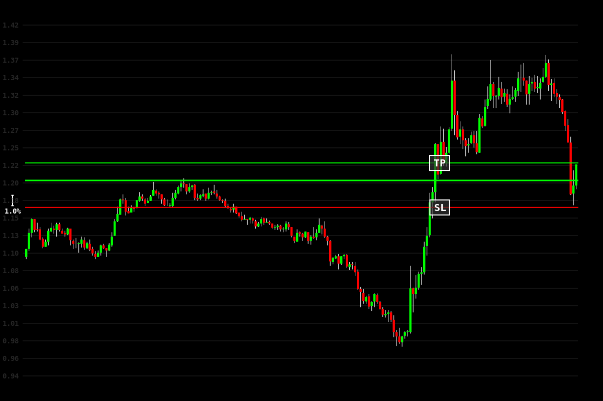

#### 30m

#### 1h
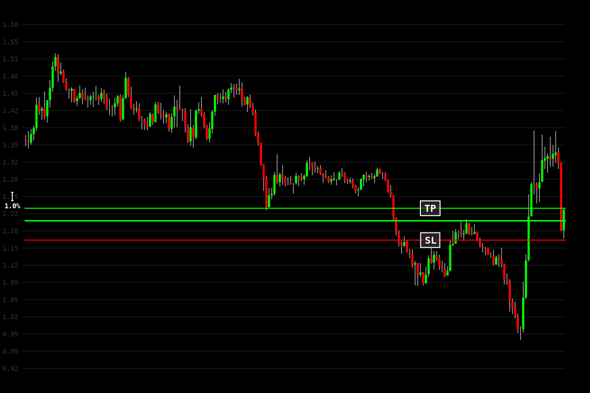

#### 4h

#### 8h
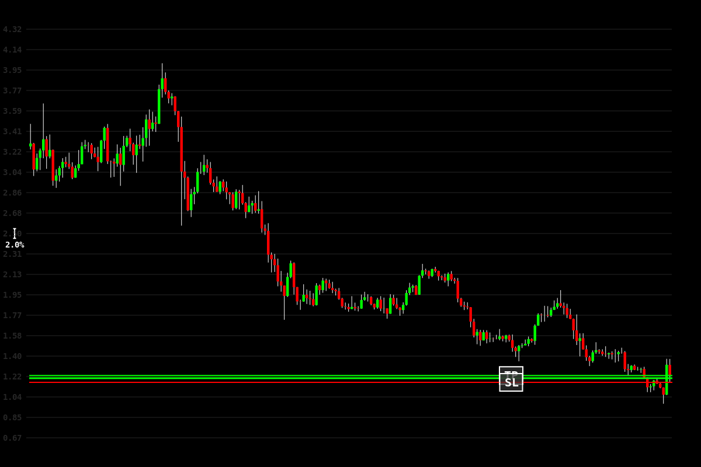

