# Trade 48

## Setup
- Pair: WIFUSDT
- Direction: Short
- Mode: real
- Take Profit: 1.201
- Stop Loss: 1.238
- Equity before: **432.53111275410004**

## Notes
<!-- Add trade notes here -->

## Images
### 10s
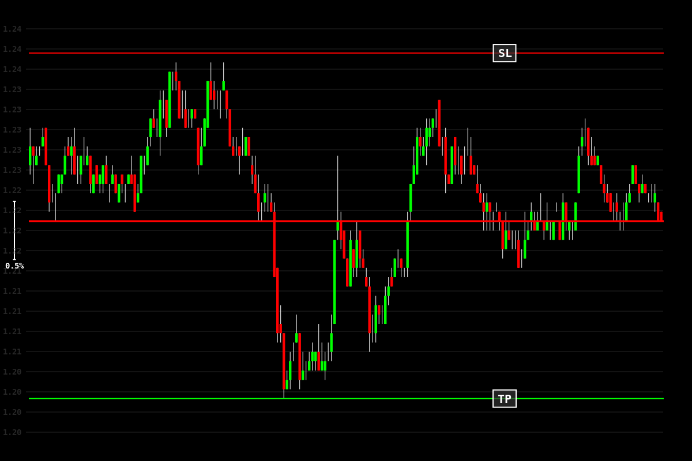

### 30s
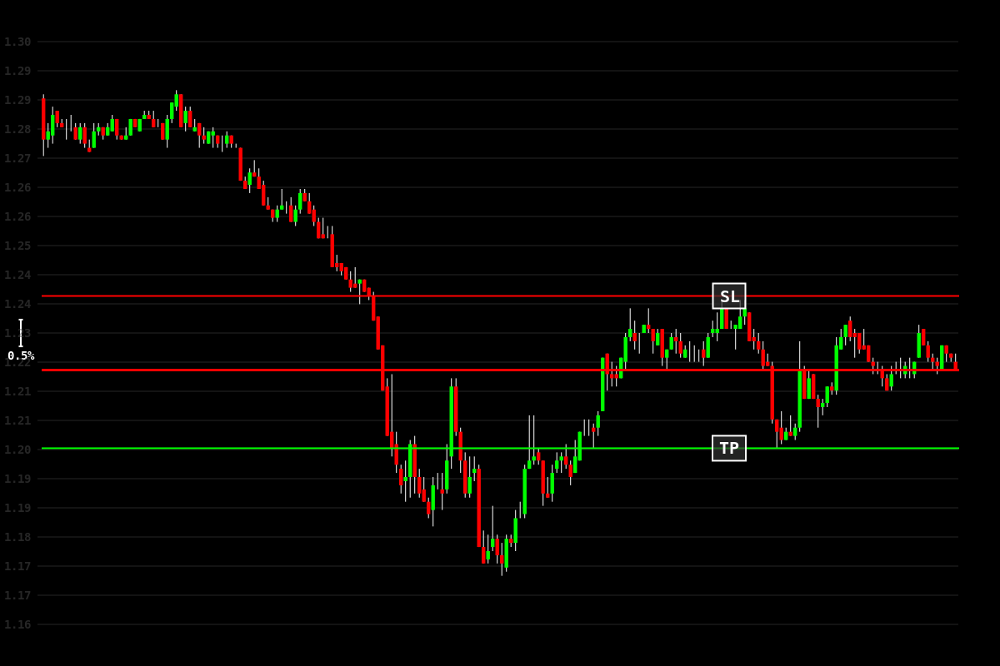

### 1m
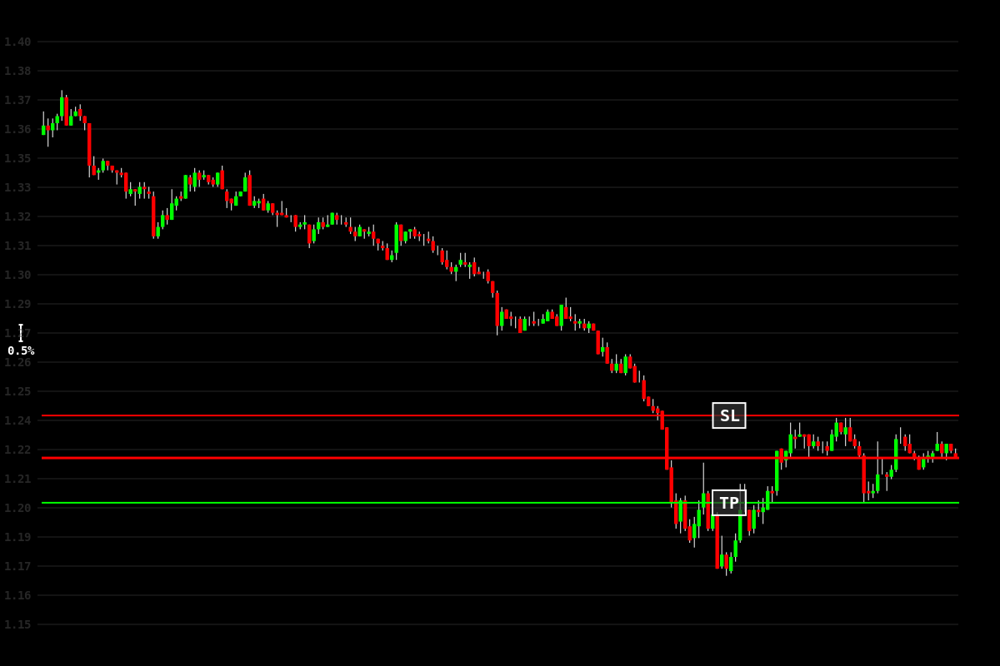

### 5m
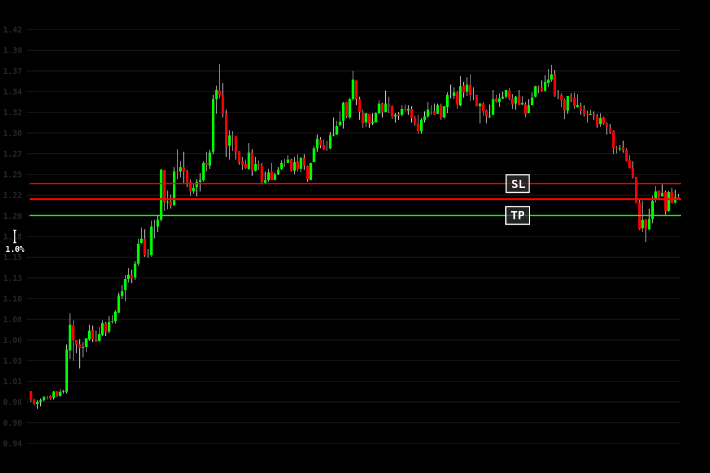

### 15m
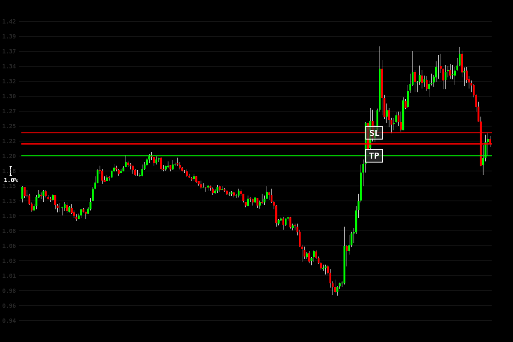

### 30m

### 1h
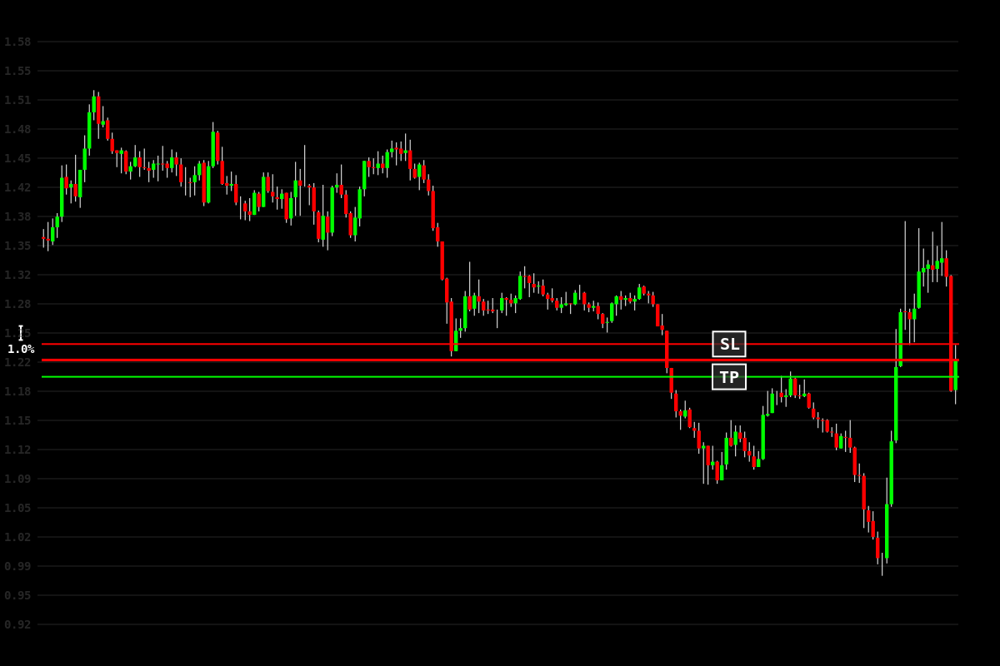

### 4h
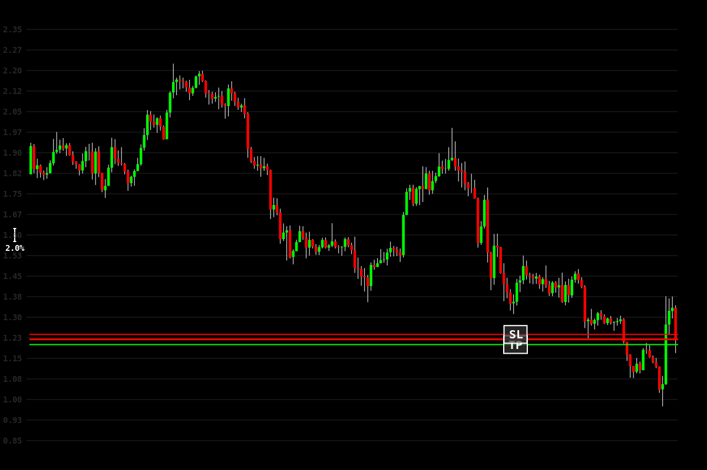

### 8h
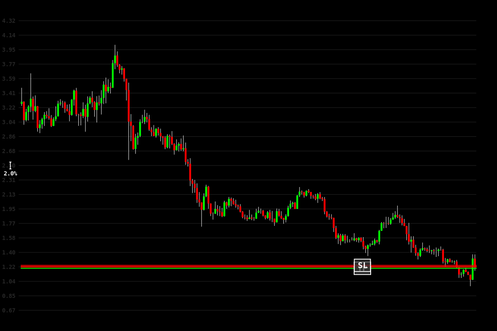

## Results

## Results
- Exit Type: exit
- PnL: $0.12
- Exit Time: 2025-01-29 16:10:18
- Trade Duration: 12 minutes
- Equity after: **432.46249391149996**

### Exit Images
#### 10s
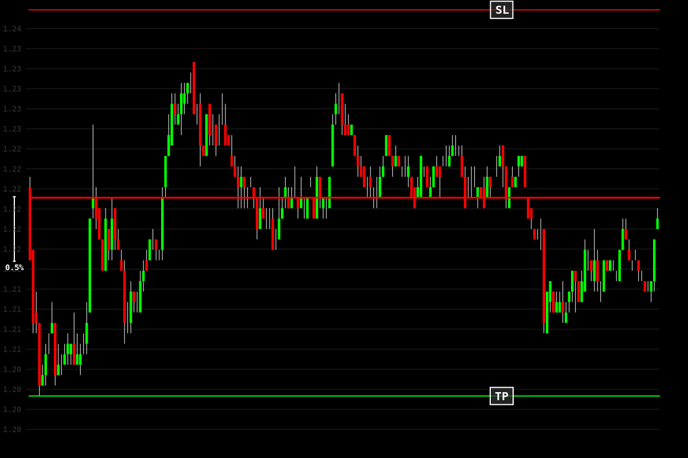

#### 30s
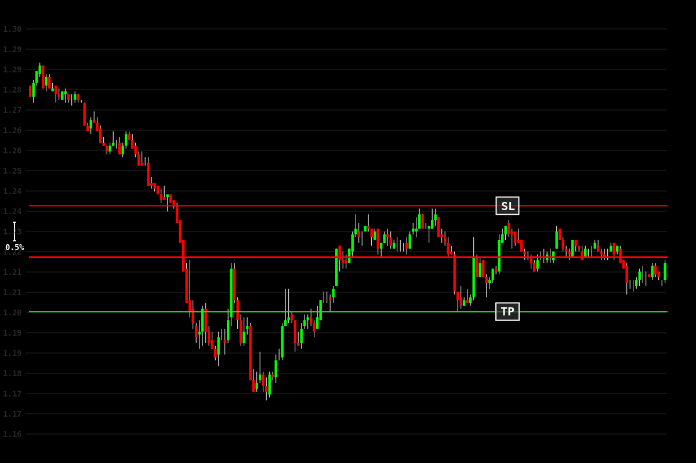

#### 1m
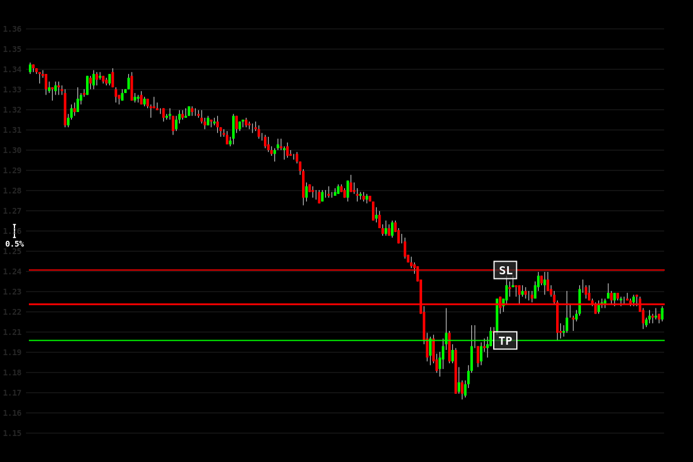

#### 5m
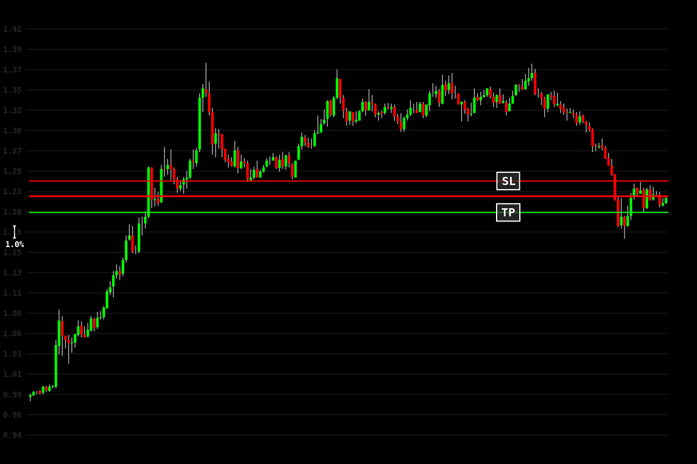

#### 15m
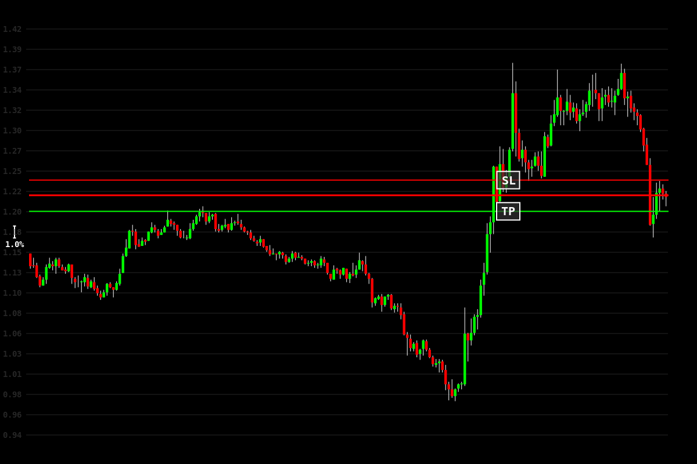

#### 30m
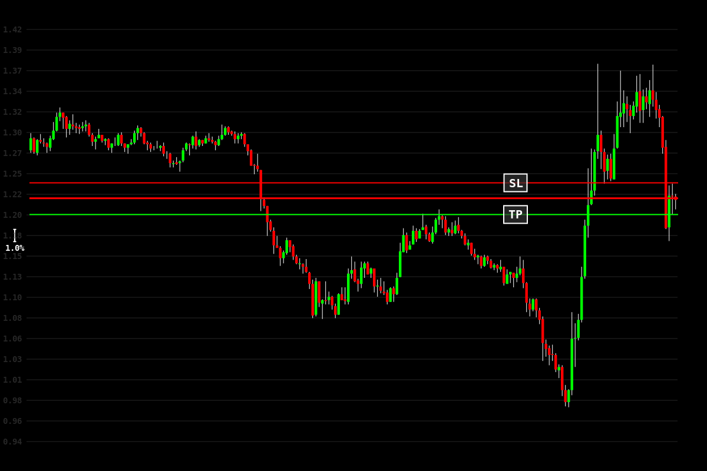

#### 1h
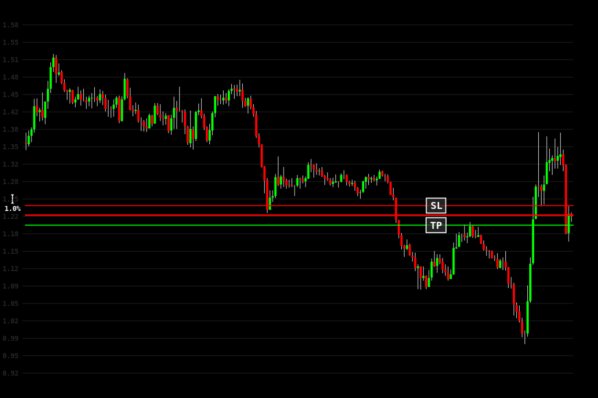

#### 4h

#### 8h

