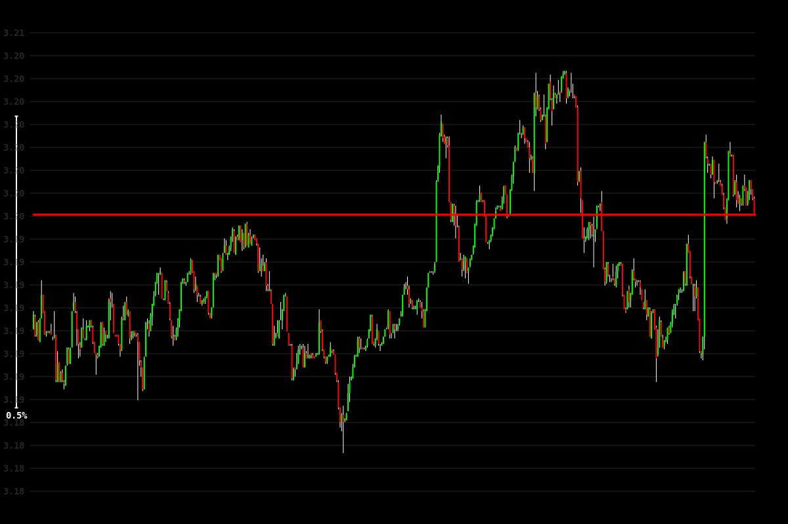

# Trade 5

## Setup
- Pair: XRPUSDT
- Direction: Short
- Mode: paper
- Take Profit: 3.163248
- Stop Loss: 3.227152

## Notes
<!-- Add trade notes here -->

## Images
### 10s

### 30s

### 1m

### 5m

### 15m

### 30m

### 1h

### 4h

### 8h

## Results
<!-- Trade results will be added here -->
